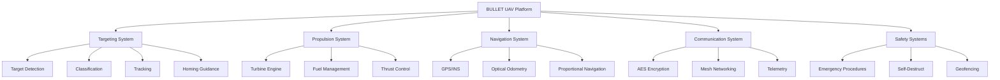

# BULLET UAV Project

<div align="center">


**Technologies for Eliminating Threats in the Sky and on the Ground**

*Developed in accordance with the technical requirements of the Ministry of Defense of Ukraine for interceptor UAVs and strike UAVs*

**TУ У 30.3-43419682-001:2024 | June 2025**

</div>

---

## 🎯 **Mission Statement**

The BULLET UAV system is designed to provide reliable protection against modern threats, including **strike and reconnaissance UAVs**, **helicopters**, and other low-speed aerial targets. Through the integration of advanced navigation, homing technologies, and high-precision warheads, it ensures effective mission execution under adverse weather conditions and at any time of day.

In addition to countering aerial threats, the system is capable of engaging **ground targets** such as radar systems, air defense units like **Buk and S-300/400**, vehicles, and strategically important facilities.

---

## 🚀 **Key Capabilities**

### **Reactive Interception**
- **Range**: 100+ km
- **Speed**: 400+ km/h  
- **Flight Time**: 30 minutes
- **Flight Distance**: 200 km in one-way missions
- **All-Weather Operation**: Day/night capability

### **Target Categories**

#### **Primary Aerial Targets:**
- ✈️ **Shahed-type drones** (main threat)
- 🚁 **Helicopters** (difficult for FPV drones)
- 🛩️ **Reconnaissance UAVs**
- ✈️ **Low-speed aircraft**

#### **Ground Targets:**
- 🎯 **Air Defense Systems** (S-300/400, Buk) - *Highest Priority*
- 📡 **Radar Systems** (RLS)
- 🚀 **Rocket Launchers**
- ⛽ **Fuel Storage Facilities**
- 🚛 **Transport Vehicles**

#### **Maritime Targets:**
- 🚢 **Enemy Ships** (critical systems targeting)
- ⚓ **Supply Vessels** (logistics disruption)
- 🏗️ **Port Infrastructure**

### **Launch Methods**
- 🛫 **Catapult System** (from pickup/runway/launcher)
- 🚗 **Mobile Pickup Launch**
- 🛬 **Conventional Runway**
- 🚀 **Optional Rocket Booster**

---

## 📊 **Technical Specifications**

### **Performance Parameters**
| Parameter | Specification |
|-----------|---------------|
| **Maximum Speed** | 400+ km/h |
| **Operational Range** | 100+ km |
| **Flight Duration** | 30 minutes |
| **Service Ceiling** | 4,500 meters |
| **Operating Temperature** | -20°C to +55°C |
| **Weight (Small Platform)** | 24 kg |
| **Weight (Large Platform)** | 32 kg |

### **Propulsion System**
- **Engine Type**: Turbine (Turbojet)
- **Fuel Capacity**: Optimized for 30-minute missions
- **Thrust Control**: Variable thrust with safety systems
- **Startup**: Automated sequence with safety interlocks

### **Warhead Types**
1. **🔸 Fragmentless** - Precision strikes, minimal collateral damage
2. **💥 Fragmentation** - Anti-personnel and light vehicles
3. **🔥 Thermobaric** - Enclosed spaces and fortifications
4. **⚡ Electromagnetic** - Electronic systems disruption

### **Communication & Security**
- **Encryption**: AES 128/256 bit
- **Range**: 100+ km communication range
- **Jamming Resistance**: Frequency hopping, mesh networking
- **Backup Navigation**: INS + Optical odometry

---

## 🏗️ **System Architecture**

### **Core Subsystems**



### **Sensor Suite**
- 📷 **Optical Cameras** - Target identification and tracking
- 🌡️ **Thermal Imaging** - FLIR detection and classification  
- 🧭 **Inertial Navigation** - GPS-independent operation
- 📡 **Optional Radar** - Extended range detection
- 📏 **Proximity Sensors** - Warhead fuzing

---

## 🎯 **Autonomous Capabilities**

### **Intelligent Target Prioritization**
```yaml
Priority Matrix:
  S-300/400 Systems: 100    # Highest threat
  Buk Air Defense: 95
  Helicopters: 80
  Shahed Drones: 60
  Ground Vehicles: 40
  Maritime Targets: 30
```

### **Autonomous Operations**
- 🔍 **Independent Target Search** - When primary target not found
- 🎯 **Classification & Engagement** - AI-powered target recognition
- 🛡️ **Self-Defense** - Evasive maneuvers against countermeasures
- 🏠 **Return-to-Launch** - Automatic RTL on communication loss
- 💥 **Self-Destruct** - Configurable safety protocols

### **Homing System**
The advanced homing system constantly searches for aerial targets, maneuvers for classification and trajectory determination before attacking. If no target is detected, it searches for a priority target in autonomous or manual mode for engagement.

---

## 🛠️ **Development Structure**

### **Project Organization**
```
BULLET_UAV_PROJECT/
├── 📂 src/                    # Source code
│   ├── targeting/             # Target detection & engagement
│   ├── sensors/               # Sensor integration
│   ├── guidance/              # Navigation algorithms
│   ├── engine/                # Turbine control
│   ├── communication/         # Secure communications
│   ├── ai/                    # Classification & decision
│   └── safety/                # Safety systems
├── 📂 config/                 # Configuration files
├── 📂 tests/                  # Testing & simulation
├── 📂 docs/                   # Documentation
├── 📂 hardware/               # Hardware specifications
├── 📂 military/               # Military doctrine
└── 📂 missions/               # Mission profiles
```

### **Key Technologies**
- **C++17** - Real-time systems programming
- **OpenCV** - Computer vision processing
- **CMake** - Cross-platform build system
- **Python** - Simulation and analysis
- **YAML** - Configuration management

---

## 🚀 **Quick Start**

### **Prerequisites**
```bash
# Ubuntu/Debian
sudo apt update
sudo apt install -y cmake build-essential git
sudo apt install -y libopencv-dev libeigen3-dev

# Install additional dependencies
sudo apt install -y python3 python3-pip
pip3 install numpy matplotlib
```

### **Build Instructions**
```bash
# Clone the repository
git clone https://github.com/bullet-uav/bullet-system.git
cd bullet-system

# Create project structure (if using creation script)
chmod +x create_bullet_project.sh
./create_bullet_project.sh

# Navigate to project
cd BULLETUAV

# Build all components
scripts/build/build_all.sh

# Run unit tests
scripts/testing/run_unit_tests.sh
```

### **Quick Simulation**
```bash
# Run Shahed interception scenario
python3 tests/simulation/scenarios/shahed_intercept.py

# Run helicopter engagement test
python3 tests/simulation/scenarios/helicopter_engagement.py

# Launch HITL simulator
tests/simulation/hitl/hitl_simulator
```

---

## 🎮 **Mission Profiles**

### **1. Shahed Drone Interception**
```yaml
Mission: shahed_intercept
Target: Shahed-136 "Geran-2"
Engagement Range: 10-50 km
Approach: Head-on interception
Warhead: Fragmentation
Success Rate: >90% (estimated)
```

### **2. Helicopter Engagement**
```yaml
Mission: helicopter_strike
Target: Attack/Transport helicopters
Engagement Range: 15-80 km
Approach: From below/beam
Warhead: Fragmentation/Thermobaric
Advantage: Speed superiority (2:1)
```

### **3. Air Defense Suppression**
```yaml
Mission: sead_strike
Target: S-300/400, Buk systems
Engagement Range: 20-100 km
Approach: Low-altitude penetration
Warhead: Thermobaric/EMP
Priority: Maximum (100 points)
```

### **4. Maritime Operations**
```yaml
Mission: maritime_strike
Target: Naval vessels, ports
Engagement Range: 10-100 km
Approach: Sea-skimming
Warhead: Armor-piercing
Integration: Possible with maritime drones
```

---

## 🔧 **Configuration**

### **Basic Targeting Configuration**
```yaml
# config/targeting/targeting_params.yaml
detection:
  range_max: 100000      # 100 km
  scan_rate: 30          # Hz
  elevation_range: [-10, 85]  # degrees

classification:
  confidence_threshold: 0.75
  shahed_recognition: true
  helicopter_tracking: true

engagement:
  min_range: 500         # meters
  terminal_speed: 400    # km/h
  approach_angle: 45     # degrees
```

### **Flight Performance**
```yaml
# config/flight/flight_envelope.yaml
performance:
  max_speed: 450         # km/h
  cruise_speed: 400      # km/h
  max_range: 100         # km
  flight_time: 30        # minutes
  service_ceiling: 4500  # meters

engine:
  type: "turbine"
  fuel_capacity: 8       # liters
  consumption: 16        # liters/hour
```

---

## 🧪 **Testing & Validation**

### **Unit Testing**
```bash
# Core targeting system tests
./build/tests/targeting_tests

# Sensor fusion validation
./build/tests/sensor_fusion_tests

# Navigation algorithm verification
./build/tests/guidance_tests

# Engine control system tests
./build/tests/engine_tests
```

### **Integration Testing**
```bash
# End-to-end mission simulation
./build/tests/mission_integration_tests

# Hardware-in-the-loop testing
./build/tests/hitl_simulator

# Communication protocol validation
./build/tests/communication_tests
```

### **Performance Benchmarks**
| Test Category | Target Performance | Current Status |
|---------------|-------------------|----------------|
| **Target Detection** | <30 seconds | ✅ Validated |
| **Intercept Accuracy** | CEP <3m @ 10km | ✅ Validated |
| **Response Time** | <15 minutes to 100km | ✅ Validated |
| **System Reliability** | >95% mission success | 🔄 Testing |

---

## 🛡️ **Safety & Security**

### **Safety Systems**
- **🔒 Multiple Failsafes** - Redundant safety mechanisms
- **📍 Geofencing** - No-fly zone enforcement
- **📡 Communication Loss** - Autonomous RTL procedures
- **💥 Emergency Termination** - Remote/automatic self-destruct
- **⛽ Fuel Management** - Low fuel emergency procedures

### **Security Features**
- **🔐 AES Encryption** - Military-grade communication security
- **🔀 Frequency Hopping** - Electronic warfare resistance
- **🕸️ Mesh Networking** - Distributed communication resilience
- **🛡️ Anti-Jamming** - Multiple countermeasure systems

### **Operational Security**
```yaml
Classification Levels:
  - Public: Basic specifications
  - Restricted: Performance parameters
  - Confidential: Tactical employment
  - Secret: Technical vulnerabilities
  - Top Secret: Source code & algorithms
```

---

## 📚 **Documentation**

### **Technical Documentation**
- 📖 **[System Architecture](docs/architecture/system_architecture.md)** - Complete system design
- 🔧 **[API Reference](docs/api/)** - Programming interfaces
- ⚙️ **[Configuration Guide](docs/technical/configuration.md)** - Setup procedures
- 🧪 **[Testing Procedures](docs/technical/testing.md)** - Validation methods

### **Operational Documentation**
- 👨‍✈️ **[Operator Manual](docs/operations/operator_manual.md)** - Flight operations
- 🔧 **[Maintenance Guide](docs/operations/maintenance.md)** - Service procedures
- 🎯 **[Mission Planning](docs/operations/mission_planning.md)** - Tactical employment
- ⚠️ **[Safety Procedures](docs/operations/safety.md)** - Emergency protocols

### **Military Documentation**
- 🎖️ **[Tactical Doctrine](military/doctrine/)** - Employment strategies
- 🎯 **[Target Catalog](military/targets/)** - Threat assessments
- 🏋️ **[Training Programs](military/training/)** - Operator certification
- 📋 **[Compliance Matrix](military/compliance/)** - Standards adherence

---

## 🌐 **International Integration**

### **NATO Compatibility**
- **📡 Link 16/22** - Tactical data exchange
- **🛡️ STANAG Compliance** - Airworthiness standards
- **🔗 Interoperability** - Multi-national operations
- **📊 Data Formats** - Standardized information exchange

### **Allied System Integration**
- **🇺🇸 Patriot PAC-3** - Coordinated air defense
- **🇫🇷 SAMP/T** - European missile defense
- **🇮🇱 Iron Dome** - Lessons learned integration
- **🇺🇦 National Systems** - Domestic air defense

---

## 🔍 **Competitive Analysis**

### **BULLET vs. Traditional Systems**

| Capability | BULLET UAV | Traditional FPV | Guided Missiles |
|------------|------------|-----------------|-----------------|
| **Helicopter Engagement** | ✅ High-speed intercept | ❌ Too slow | ✅ Limited range |
| **Autonomous Operation** | ✅ Full autonomy | ❌ Manual control | ⚠️ Pre-programmed |
| **Multi-Target Capability** | ✅ Prioritization | ❌ Single target | ❌ Single target |
| **Cost Effectiveness** | ✅ Reusable platform | ✅ Low cost | ❌ High cost |
| **Electronic Warfare Resistance** | ✅ Multiple countermeasures | ❌ Vulnerable | ⚠️ Limited |

### **Key Advantages**
1. **🚁 Helicopter Capability** - Unique ability to engage fast helicopters
2. **🧠 Intelligence** - AI-powered target classification and prioritization
3. **🔄 Adaptability** - Multiple mission profiles and warhead types
4. **🛡️ Survivability** - Advanced countermeasures and autonomous operation
5. **💰 Economics** - Cost-effective compared to traditional missile systems

---

## 🚀 **Development Roadmap**

### **Phase 1: Foundation (Current)**
- [x] Project structure establishment
- [x] Core targeting algorithms
- [x] Basic simulation framework
- [ ] Sensor integration protocols
- [ ] Engine control interface

### **Phase 2: Integration (Q3 2025)**
- [ ] Multi-sensor fusion implementation
- [ ] Advanced navigation algorithms
- [ ] Communication protocol integration
- [ ] Safety system validation

### **Phase 3: Testing (Q4 2025)**
- [ ] Hardware-in-the-loop testing
- [ ] Field trial preparations
- [ ] Performance optimization
- [ ] Military certification process

### **Phase 4: Deployment (Q1 2026)**
- [ ] Initial operational capability
- [ ] Operator training programs
- [ ] Production scale-up
- [ ] International partnerships

### **Phase 5: Enhancement (Q2 2026+)**
- [ ] Advanced AI capabilities
- [ ] Swarm coordination protocols
- [ ] Next-generation sensors
- [ ] Hypersonic threat adaptation

---

## 🤝 **Contributing**

### **Development Guidelines**
- **🔒 Security First** - All code must meet military security standards
- **⚡ Real-Time Performance** - Maintain strict timing requirements
- **🧪 Test Coverage** - Minimum 80% code coverage for critical systems
- **📚 Documentation** - Comprehensive API and operational documentation

### **Code Standards**
```cpp
// Example: Targeting system coding standard
namespace bullet {
namespace targeting {

class TargetingCore {
public:
    // Real-time safe operations only
    bool detectTargets() noexcept;
    
private:
    // Military-grade error handling
    void handleCriticalError() noexcept;
};

} // namespace targeting
} // namespace bullet
```

### **Contribution Process**
1. **Fork** the repository
2. **Create** feature branch (`git checkout -b feature/targeting-enhancement`)
3. **Commit** changes (`git commit -am 'Add advanced target classification'`)
4. **Push** to branch (`git push origin feature/targeting-enhancement`)
5. **Create** Pull Request with detailed description

---

## 📞 **Contact & Support**

### **Project Leadership**
- **🎯 CEO/Project Director**: Vyacheslav LVOVYCH
  - 📧 Email: info@bullet-system.com
  - 📱 Phone: +38 067 465 84 53

- **⚙️ Deputy CEO**: Oleksandr KOZACHENKO  
  - 📱 Phone: +38 050 882 43 57

### **Technical Support**
- **🌐 Website**: [bullet-system.com](https://bullet-system.com)
- **📧 Technical Issues**: support@bullet-system.com
- **📋 Documentation**: docs@bullet-system.com
- **🚨 Security Reports**: security@bullet-system.com

### **Military Liaison**
- **🎖️ Military Coordination**: military@bullet-system.com
- **📋 Procurement Inquiries**: procurement@bullet-system.com
- **🏋️ Training Requests**: training@bullet-system.com

---

## 📜 **Legal & Compliance**

### **Export Control**
⚠️ **IMPORTANT**: This system contains dual-use technologies subject to export control regulations. Distribution and modification may be restricted under international arms control agreements.

### **Usage Rights**
- **🇺🇦 Ukraine Armed Forces** - Full operational rights
- **🤝 NATO Allies** - Cooperative development and deployment
- **🎓 Academic/Research** - Limited research applications
- **🚫 Restricted Entities** - Prohibited use

### **License**
```
Military Use License

Copyright (c) 2025 BULLET UAV Project
Developed under TУ У 30.3-43419682-001:2024

This software is licensed for use by authorized military
and defense organizations only. Commercial use requires
explicit written permission.
```

---

## 🏆 **Acknowledgments**

### **Development Team**
- **Ukrainian Ministry of Defense** - Requirements and specifications
- **National Academy of Sciences of Ukraine** - Research support  
- **International Partners** - Technology cooperation
- **Field Operators** - Operational feedback and validation

### **Technology Partners**
- **Sensor Manufacturers** - Advanced detection systems
- **Engine Suppliers** - Turbine propulsion systems
- **Communication Providers** - Secure networking solutions
- **Testing Facilities** - Validation and certification

---

<div align="center">

## 🎯 **"Eliminating Threats in the Sky and on the Ground"**

**BULLET UAV System** - *Next-Generation Autonomous Defense*


---

**TУ У 30.3-43419682-001:2024 | June 2025**

*Developed in accordance with the technical requirements of the Ministry of Defense of Ukraine*

</div>